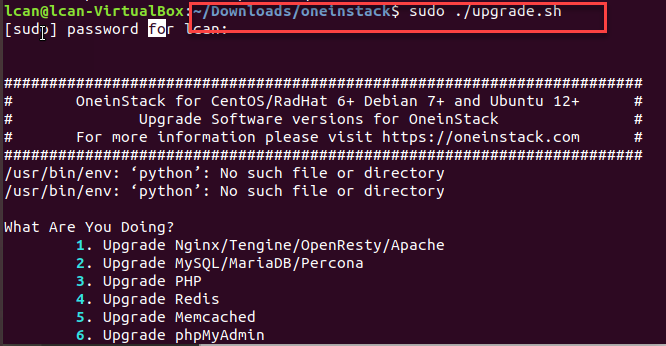

# OneinStack

### 简介:

> 一键安装或者卸载环境组合，适用于linux系统

下载地址：[https://oneinstack.com/download/](https://oneinstack.com/download/)

> 以下所有的操作(除了管理服务)必须首先进入到oneinstack文件夹中

### 安装

按照官方文档即可，官方操作文档：[https://oneinstack.com/install/](https://oneinstack.com/install/)

**1.** 进入 oneinstack文件

**2.** 获得权限，运行 **install.sh**文件进行安装自己所需要的环境

**3. 安装中**

**4. 安装完成**

----------

### 卸载

执行**uninstall.sh**文件即可

----------

### 版本更新

执行**upgrade.sh**文件即可

----------

### 备份

执行**backup_setup.sh**文件即可，可以对数据库或者网站数据进行本地备份或者云备份。

### 管理服务

详见[https://oneinstack.com/install/](https://oneinstack.com/install/)

基本上都是以下格式：

    service 服务名称 {start|stop|restart|reload|status}

