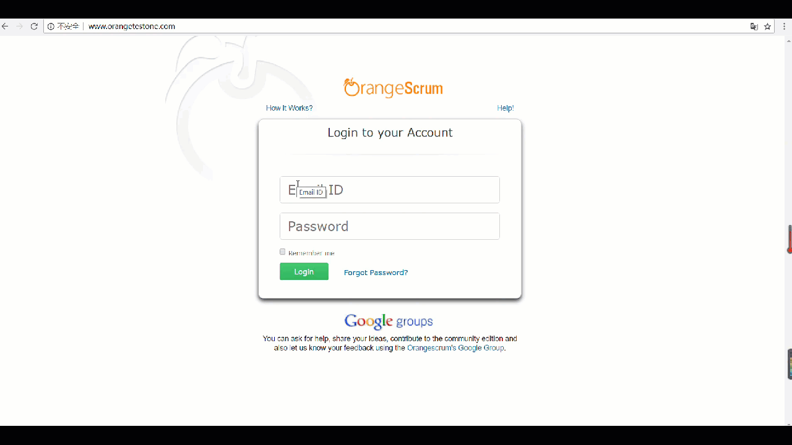
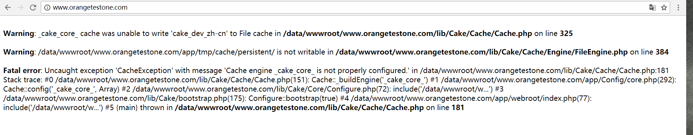
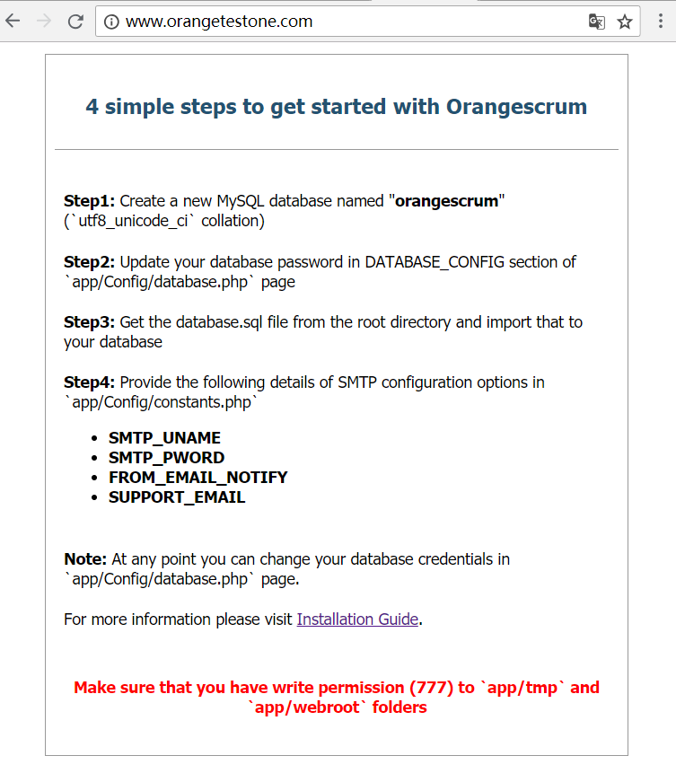
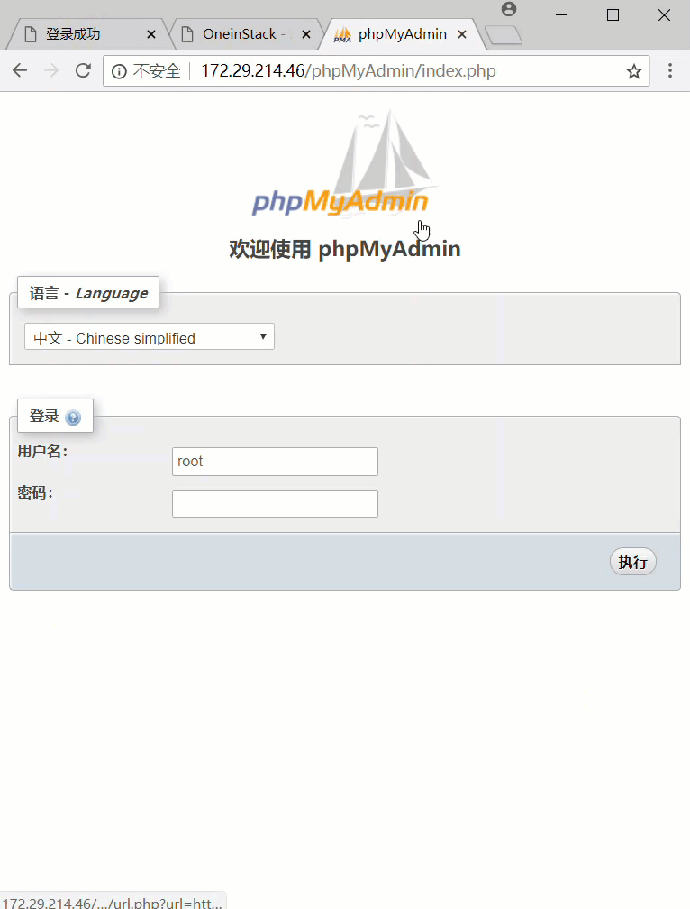
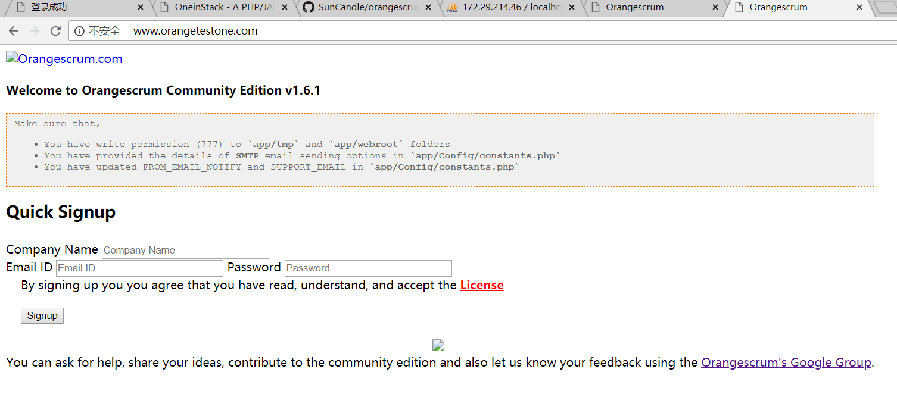
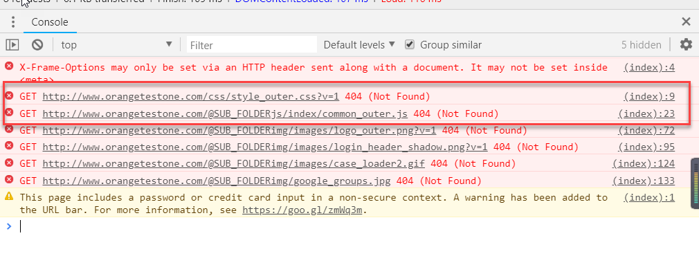
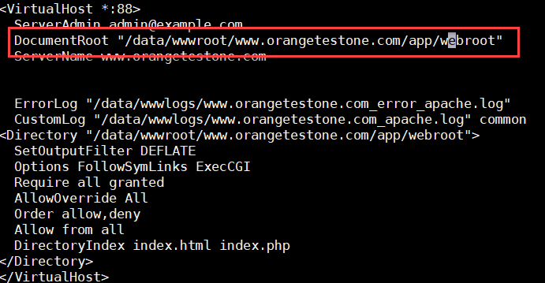
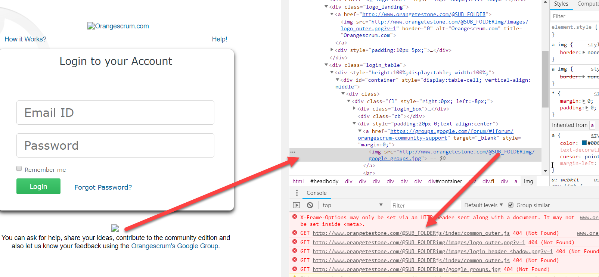
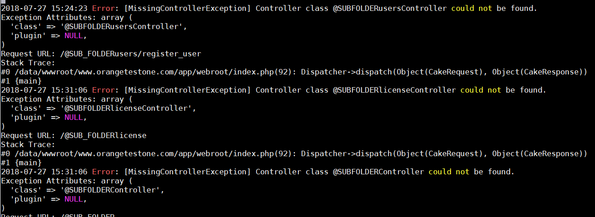
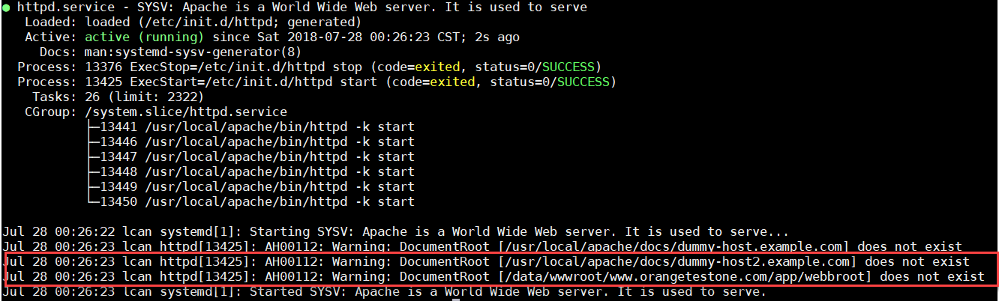

# orangescrum

环境要求：

- Apache（启动mod_rewrite）
- mysql至少5.3版本以上
- php至少5.3以上，最好7以下
- 关闭mysql的严格模式

步骤：

- 创建虚拟主机
- 克隆项目到工作目录中
- 浏览器访问虚拟主机，按照提示操作

使用的环境：

-  Apache2.4
-  Nginx1.41
-  php5.6
-  mysql5.7

安装完成后的样子：

### 安装总结

1.  虚拟主机的使用
2.  phpMyAdmin操作数据库
1.  查看错误日志分析存在的错误问题
2.  通过Chrome的检查解决图片问题
1.  根据Apache或者Nginx的状态查找错误的地方
1.  lnmp一键安装配置环境下mysql5.7的严格模式的关闭
1.  学到的一些的linux操作以及其他知识

#### 1. 虚拟主机的使用

**步骤：**

1. virtualbox中该虚拟机的网络连接方式选择**桥接网卡**（当然还有其他方式）以获得分配的ip地址，此时实际主机可以和虚拟机进行互ping
2. Oneinstack中执行./vhost.sh文件创建虚拟主机
3. 修改hosts文件，我用的是Windows操作系统，文件在\Windows\System32\drivers\etc，添加虚拟主机的域名以及其绑定的ip地址，比如：我的虚拟机获得的IP是192.168.0.101，虚拟主机的domain是www.orangelcan.com，则将这组对应添加到hosts文件中

	`192.168.0.101 www.orangetest.com`

4. 完成前面三步后，就可以通过Windows上的浏览器访问虚拟机的ip及虚拟主机了。如图：

按提示给予相应文件写的权限后就可以看到安装提示了

    cd  /data/wwwroot/www.orangetestone.com/app
    chmod -R 0777 Config/*
    chmod -R 0777 tmp/*
    chmod -R 0777 webroot/*

> 一个ip可以绑定多个域名，但是一个域名只能绑定一个ip

#### 2.  phpMyAdmin操作数据库

访问：虚拟机ip/phpMyAdmin  	

#### 3. 查看错误日志分析存在的错误问题

###### 3.1 案例一 

找到虚拟主机的错误的日志存放位置：（以我的为例）

    /data/wwwlogs/www.orangetest.com_error_apache_log

可以看到问题出现的原因，然后就可以根据出现的问题去寻找解决的方案。

###### 3.2 案例二

网页中出现如下问题：database connection

我们可以进入到/app/Config中的tmp目录下的文件寻找错误原因，我们进入/tmp后看到有文件error.log，存放着数据库连接错误的原因。我们可以看到出现了`PDOException: SQLSTATE[HY000]: General error: 3065`此类错误。

寻找解决方案后，觉得有可能是mysql的严格模式未关闭所致，因此尝试关闭严格模式，重启mysql，发现新大陆，问题解决。

#### 4. 通过Chrome的检查解决图片问题

出现了图片损坏情况如图：

通过chrmoe的检查可见，css等文件找不到，这应该是因为根目录位置不对所致的。

后来我们发现css等文件在/app/webroot目录下，因此依次把在Nginx和Apache配置中的站点的根目录修改至/app/webroot，图片问题得到解决。

nginx配置图略

但是sign up下边的破损图片仍然未解决，从Chrome看出地址这个地方出错了 `@SUB_FOLDER`

我们再来看看该工作目录下的错误日志文件，在app/tmp/logs目录下的`error.log`中有记录

我们看到了问题就是出在@SUB_FOLDER上，查阅了相关资料后，找到了修改的方法，@SUB_FOLDER出现在app/Config/constants.php中。我们对constants.php做出以下修改即可解决问题

    define('SUB_FOLDER', '@SUB_FOLDER');  修改为  define('SUB_FOLDER', '/');

#### 5. 查看Apache或者Nginx的状态查找错误的地方

    service httpd status
    service Nginx status

看到问题出现所在，文件夹不存在，很明显更目录写错了。那么我们把他写对之后，在重启下Nginx和Apache，好的问题解决了。

#### 6. lnmp一键安装配置环境下mysql5.7的严格模式的关闭

关闭mysql的严格模式，一般是在/etc/my.cnf中进行更改，但是这对于使用lnmp一键安装的方式配置的环境而言，有可能会不起作用，那么我们可以通过在/usr/local/mysql/my.cnf中进行更改，如果在/usr/local/mysql中没有my.cnf文件，则新创建一个my.cnf文件，并写入以下语句：

    [mysqld]
    sql_mode = NO_ENGINE_SUBSTITUTION

之后重启mysql即可

#### 7. 学到的一些的linux操作以及其他知识

添加权限：`chmod  -权限类型（rwf） XXX filename/`

sudo su: 直接将root全部权限交给了用户，进而该用户可以操作具有root权限的操作

vim中编辑文件：`?field 搜索关键字段`

清空文件内容：`echo "" > file` 

mysql中datatime类型的取值范围：`1000-01-01 00:00:00 到 9999-12-31 23:59:59`

