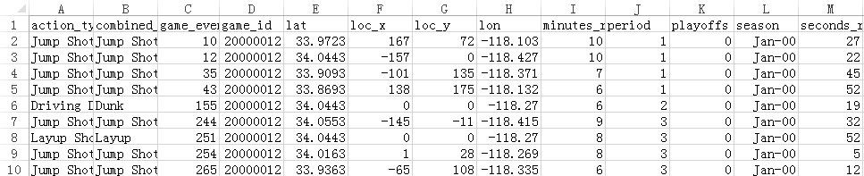
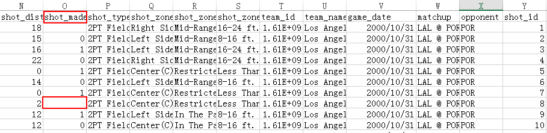
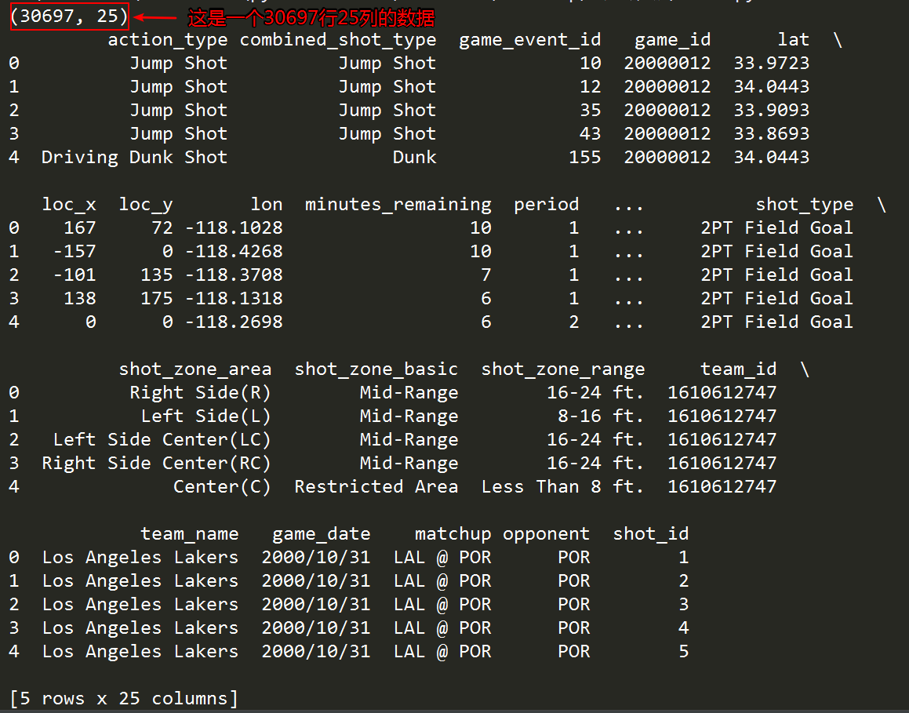
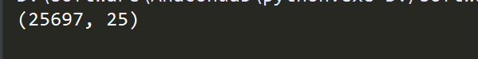
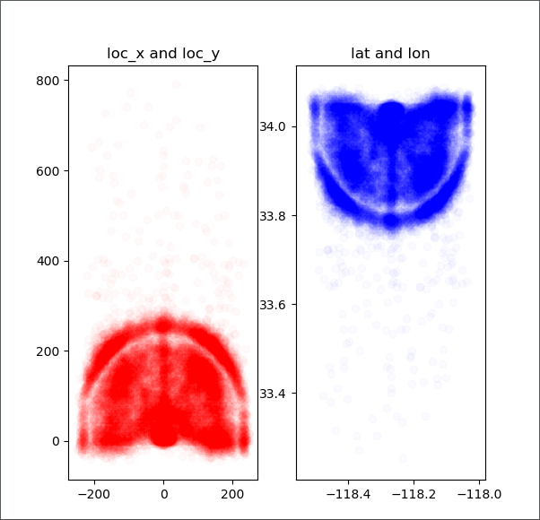
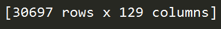
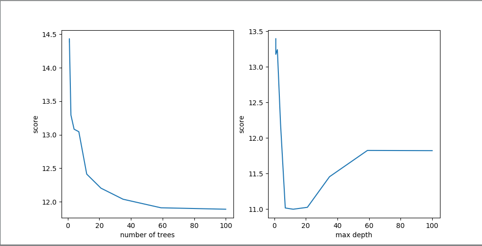
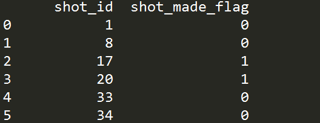

## 一、前言
---
本文所讲的实战内容是用机器学习的方法来分析科比职业生涯数据的实例，利用随机森林分类器训练处一个预测科比投篮模型。主要用了python的numpy，pandas，matplotlib和sklearn库。

本文出现的所有代码，均可在我的github上下载，欢迎Follow、Star：[github地址](https://github.com/yaoguangju/machine_learning_practice)

## 二、设计思路
---
先来看看这份科比生涯的数据集：[数据集下载](https://github.com/yaoguangju/machine_learning_practice/blob/master/%E9%A2%84%E6%B5%8B%E7%A7%91%E6%AF%94%E7%94%9F%E6%B6%AF%E6%95%B0%E6%8D%AE/1.%E5%AE%9E%E6%88%98%E4%BB%A3%E7%A0%81/data.csv)




这个表格记录了科比30000多个镜头的详细数据，共有25个标签。

具体的设计思路是将这25个标签代表的数据进行分析，找出对科比投篮结果有影响的标签，利用机器学习中随机森林的算法训练出可以预测科比是否能够投篮命中的模型。

先来看看这25个标签具体代表什么(自己不是篮球的专业人士和爱好者，所以具体的内容可能有所出入，不过不会影响到分析结果)

- action_type（用什么方式投的篮）
- combined_shot_type（结合什么方式投篮）
- game_event_id（游戏事件ID）
- game_id（游戏ID）
- la（投篮的经度）
- loc_x （投篮的x坐标）
- loc_y（投篮的y坐标）
- lon（投篮的纬度）
- minutes_remaining（离比赛结束还有多少分钟）
- period（第几场）
- playoffs（是不是季后赛）
- season（赛季）
- seconds_remaining（离比赛结束还有多少秒）
- shot_distance（投篮离篮筐的的距离）
- shot_made_flag （是不是进球了(主要的标签)）
- shot_type（2分球还是3分球区域）
- shot_zone_area（投篮区域的表示方法一）
- shot_zone_basic（投篮区域的表示方法二）
- shot_zone_range（投篮区域的表示方法三）
- team_id（队伍ID）
- team_name（队伍名字）
- game_date（比赛时间）
- matchup（比赛双方队伍）
- opponent（自己所在队伍名字）
- shot_id（镜头ID）

可以看到，这25个标签中对于科比能否投篮命中有一些无关紧要的数据，比如team_id，因为这30000多份样本中全是在湖人队打的，shot_id，game_id等等这个数据也无关紧要，具体的分析将会在下面讲解。

## 三、数据分析
---
首先我们导入数据，编写代码如下
```python
import pandas as pd

# 导入数据
filename= "data.csv"
raw = pd.read_csv(filename)
print(raw.shape)
print(raw.head())  #head函数打印前5行，如果需要打印前10行，这样写
```
运行结果如下



接下来我们再来分析这一份数据表，我们发现其中shot_made_flag这个标签竟然有缺失值，这个表示了科比是否进球了，作为最重要的数据，是不能随意进行填充的，我们必须删除掉这些样本进行下一步的工作，代码如下
```python
import pandas as pd

# 导入数据
filename= "data.csv"
raw = pd.read_csv(filename)

kobe =  raw[pd.notnull(raw['shot_made_flag'])]
print(kobe.shape)
```
运行结果如下



此时我们只有25697个数据进行训练了。

接着我们分析lat，loc_x，loc_y，lon这4个标签，这4个标签说明了科比投篮的位置，而具体指的是什么呢，有什么关系吗，我们画散点图来看一下。

编写代码如下

```python
import pandas as pd
import matplotlib.pyplot as plt

# 导入数据
filename= "data.csv"
raw = pd.read_csv(filename)


#删除shot_made_flag为空的数据项，并且命名为kobe用作训练
kobe =  raw[pd.notnull(raw['shot_made_flag'])]


#画散点图用来分析lat loc_x  loc_y lon这4个标签
alpha = 0.02   #指定一个数字，用于后面的透明度
plt.figure(figsize=(6,6))  #指定画图域
# loc_x and loc_y
plt.subplot(121)    #一行两列   第一个位置
plt.scatter(kobe.loc_x, kobe.loc_y, color='R', alpha=alpha)   #画散点图
plt.title('loc_x and loc_y')
# lat and lon
plt.subplot(122)    #一行两列   第二个位置
plt.scatter(kobe.lon, kobe.lat, color='B', alpha=alpha)
plt.title('lat and lon')
plt.show()
```
运行结果如图所示


我们大致可以看出，这4个坐标大致表示了距离篮筐的距离，那样的话，我们接下来用于数据处理的时候选择其中的一组数据即可了。

shot_type，shot_zone_area，shot_zone_basic，shot_zone_range 这4个标签代表了投篮的区域，其实还是说明一件事，这里就不做赘述了，当然shot_zone_area，shot_zone_basic，shot_zone_range这3个标签将投篮区域相比于shot_type来说分的更细，直接删掉是不是会有问题，其实大可不必担心，因为，接下来我们将会用极坐标的形式表示科比的投篮位置，将更会细化科比的投篮区域。

## 四、数据处理
---
首先处理我们上节所说的极坐标的问题，然后我们会发现算出来的dist和，shot_distance竟然具有正相关性。
```python
import pandas as pd
import numpy as np
import matplotlib.pyplot as plt
import time
from sklearn.ensemble import RandomForestClassifier  #导入随机森林分类器
from sklearn.cross_validation import KFold
from sklearn.metrics import log_loss

# 导入数据
filename= "data.csv"
raw = pd.read_csv(filename)


#删除shot_made_flag为空的数据项，并且命名为kobe用作训练
kobe =  raw[pd.notnull(raw['shot_made_flag'])]


#对于lat，loc_x，loc_y，lon这4个标签，我们取loc_x和loc_y这2个标签，并将其转化为极坐标的形式
#dist表示离篮筐的距离，angle表示投篮的角度，这样将会更好的科比投篮的反应结果`
raw['dist'] = np.sqrt(raw['loc_x']**2 + raw['loc_y']**2)
loc_x_zero = raw['loc_x'] == 0
raw['angle'] = np.array([0]*len(raw))
raw['angle'][~loc_x_zero] = np.arctan(raw['loc_y'][~loc_x_zero] / raw['loc_x'][~loc_x_zero])
raw['angle'][loc_x_zero] = np.pi / 2

#画图展示dist和shot_distance的正相关性
plt.figure(figsize=(5,5))
plt.scatter(raw.dist, raw.shot_distance, color='blue')
plt.title('dist and shot_distance')
plt.show()
```
运行结果如下


这样我们可以保留其中的一个(这里我们保留了dist这个标签)，接着我们将minutes_remaining和seconds_remaining转化成一个标签remaining_time，然后删除不必要的列，非数值型的转换成onehot编码格式

具体编写代码如下，具体说明在代码注释中
```python
import pandas as pd
import numpy as np
import matplotlib.pyplot as plt

# 导入数据
filename= "data.csv"
raw = pd.read_csv(filename)


#删除shot_made_flag为空的数据项，并且命名为kobe用作训练
kobe =  raw[pd.notnull(raw['shot_made_flag'])]


#对于lat，loc_x，loc_y，lon这4个标签，我们取loc_x和loc_y这2个标签，并将其转化为极坐标的形式
#dist表示离篮筐的距离，angle表示投篮的角度，这样将会更好的科比投篮的反应结果
raw['dist'] = np.sqrt(raw['loc_x']**2 + raw['loc_y']**2)
loc_x_zero = raw['loc_x'] == 0
raw['angle'] = np.array([0]*len(raw))
raw['angle'][~loc_x_zero] = np.arctan(raw['loc_y'][~loc_x_zero] / raw['loc_x'][~loc_x_zero])
raw['angle'][loc_x_zero] = np.pi / 2


#对于minutes_remaining：离比赛结束还有多少分钟；seconds_remaining：离比赛结束还有多少秒（0-60），这
#2个属性我们合成距离比赛结束的时间
raw['remaining_time'] = raw['minutes_remaining'] * 60 + raw['seconds_remaining']


#机器学习只能识别数值型的数据
#将赛季中'Jan-00' 'Feb-01' 'Mar-02'  ···  '1998-99'转换成
# 0  1  2  ··· 99
raw['season'] = raw['season'].apply(lambda x: int(x.split('-')[1]) )


#删除对于比赛结果没有影响的数据
drops = ['shot_id', 'team_id', 'team_name', 'shot_zone_area', 'shot_zone_range', 'shot_zone_basic','matchup', 'lon',
         'lat', 'seconds_remaining', 'minutes_remaining','shot_distance', 'loc_x', 'loc_y', 'game_event_id', 'game_id',
         'game_date']
for drop in drops:
    raw = raw.drop(drop, 1)


#将非数值型的数据转换成为onehot编码的格式，加入到数据中并且将原来的数据删除
categorical_vars = ['action_type', 'combined_shot_type', 'shot_type', 'opponent', 'period', 'season']
for var in categorical_vars:
    raw = pd.concat([raw, pd.get_dummies(raw[var], prefix=var)], 1)
    raw = raw.drop(var, 1)
print(raw)
```
结果调试器里面显示的效果不太好，只附上最后的行和列吧


为什么会有129行之多，是因为我们用了onehot编码，具体什么是onehot编码这里就不做赘述了，感兴趣的可以谷歌或者百度一下。

最后我们总结一下，到底这25个标签还剩下什么，首先除去和比赛结果无关的标签，'shot_id', 'team_id', 'team_name', 'shot_zone_area', 'shot_zone_range', 'shot_zone_basic','matchup', 'lon',
'lat', 'seconds_remaining', 'minutes_remaining'，'shot_distance', , 'game_event_id', 'game_id',
 'game_date'

 然后'loc_x', 'loc_y'转换成了极坐标的形式，变成了'dist','angle';'seconds_remaining'和'minutes_remaining'合并成了'remaining_time'。

 最后将'action_type', 'combined_shot_type', 'shot_type', 'opponent', 'period', 'season'转换成onehot编码格式。

 至此我们的数据处理工作基本完成了。

## 五、利用sklearn来进行数据的处理
---
具体的思路是利用随机森林分类器配合着交叉验证的方法进行数据的分析，先找到最佳的树的个数，和树的深度。

编写代码如下
```python
import pandas as pd
import numpy as np
import matplotlib.pyplot as plt
import time
from sklearn.ensemble import RandomForestClassifier  #导入随机森林分类器
from sklearn.cross_validation import KFold
from sklearn.metrics import log_loss

# 导入数据
filename= "data.csv"
raw = pd.read_csv(filename)


#删除shot_made_flag为空的数据项，并且命名为kobe用作训练
kobe =  raw[pd.notnull(raw['shot_made_flag'])]


#对于lat，loc_x，loc_y，lon这4个标签，我们取loc_x和loc_y这2个标签，并将其转化为极坐标的形式
#dist表示离篮筐的距离，angle表示投篮的角度，这样将会更好的科比投篮的反应结果`
raw['dist'] = np.sqrt(raw['loc_x']**2 + raw['loc_y']**2)
loc_x_zero = raw['loc_x'] == 0
raw['angle'] = np.array([0]*len(raw))
raw['angle'][~loc_x_zero] = np.arctan(raw['loc_y'][~loc_x_zero] / raw['loc_x'][~loc_x_zero])
raw['angle'][loc_x_zero] = np.pi / 2


# 对于minutes_remaining：离比赛结束还有多少分钟；seconds_remaining：离比赛结束还有多少秒（0-60），这
# 2个属性我们合成距离比赛结束的时间
raw['remaining_time'] = raw['minutes_remaining'] * 60 + raw['seconds_remaining']


#机器学习只能识别数值型的数据
#将赛季中'Jan-00' 'Feb-01' 'Mar-02'  ···  '1998-99'转换成
# 0  1  2  ··· 99
raw['season'] = raw['season'].apply(lambda x: int(x.split('-')[1]) )


# 删除对于比赛结果没有影响的数据
drops = ['shot_id', 'team_id', 'team_name', 'shot_zone_area', 'shot_zone_range', 'shot_zone_basic','matchup', 'lon',
         'lat', 'seconds_remaining', 'minutes_remaining','shot_distance', 'loc_x', 'loc_y', 'game_event_id', 'game_id',
         'game_date']
for drop in drops:
    raw = raw.drop(drop, 1)


#将非数值型的数据转换成为onehot编码的格式，加入到数据中并且将原来的数据删除
categorical_vars = ['action_type', 'combined_shot_type', 'shot_type', 'opponent', 'period', 'season']
for var in categorical_vars:
    raw = pd.concat([raw, pd.get_dummies(raw[var], prefix=var)], 1)
    raw = raw.drop(var, 1)


#将数据分为训练集和测试集
train_kobe = raw[pd.notnull(raw['shot_made_flag'])]
train_label = train_kobe['shot_made_flag']
train_kobe = train_kobe.drop('shot_made_flag', 1)

test_kobe = raw[pd.isnull(raw['shot_made_flag'])]
test_kobe = test_kobe.drop('shot_made_flag', 1)


print('寻找随机森林分类器的的最佳树的数量...')
min_score = 100000
best_n = 0
scores_n = []
range_n = np.logspace(0, 2, num=10).astype(int)
for n in range_n:
    print('树的数量 : {0}'.format(n))
    t1 = time.time()
    rfc_score = 0.
    rfc = RandomForestClassifier(n_estimators=n)
    for train_k, test_k in KFold(len(train_kobe), n_folds=10, shuffle=True):
        rfc.fit(train_kobe.iloc[train_k], train_label.iloc[train_k])
        pred = rfc.predict(train_kobe.iloc[test_k])
        rfc_score += log_loss(train_label.iloc[test_k], pred) / 10
    scores_n.append(rfc_score)
    if rfc_score < min_score:
        min_score = rfc_score
        best_n = n
    t2 = time.time()
    print('建造 {0} 颗树(耗时{1:.3f}秒)'.format(n, t2 - t1))
print("最佳树的颗树为 : {0},得分为: {1}".format(best_n,min_score))

print('\n')

print('寻找随机森林分类器的最佳树的最佳深度...')
min_score = 100000
best_m = 0
scores_m = []
range_m = np.logspace(0, 2, num=10).astype(int)
for m in range_m:
    print("树的最大的深度 : {0}".format(m))
    t1 = time.time()
    rfc_score = 0.
    rfc = RandomForestClassifier(max_depth=m, n_estimators=best_n)
    for train_k, test_k in KFold(len(train_kobe), n_folds=10, shuffle=True):
        rfc.fit(train_kobe.iloc[train_k], train_label.iloc[train_k])
        pred = rfc.predict(train_kobe.iloc[test_k])
        rfc_score += log_loss(train_label.iloc[test_k], pred) / 10
    scores_m.append(rfc_score)
    if rfc_score < min_score:
        min_score = rfc_score
        best_m = m
    t2 = time.time()
    print('树的最大深度为: {0}(耗时{1:.3f}秒)'.format(m, t2 - t1))
print('最佳树的深度: {0},得分为：{1}'.format(best_m, min_score))

plt.figure(figsize=(10,5))
plt.subplot(121)
plt.plot(range_n, scores_n)
plt.ylabel('score')
plt.xlabel('number of trees')

plt.subplot(122)
plt.plot(range_m, scores_m)
plt.ylabel('score')
plt.xlabel('max depth')
plt.show()
```
运行结果如下，说明当树的颗树为100，并且深度为12的时候，损失函数最小，下面是具体的得分图示。



下面我们用100,12这个参数训练模型，并且预测出5000个'shot_made_flag'的缺失值。

```python
import pandas as pd
import numpy as np
import matplotlib.pyplot as plt
import time
from sklearn.ensemble import RandomForestClassifier  #导入随机森林分类器
from sklearn.cross_validation import KFold
from sklearn.metrics import log_loss

# 导入数据
filename = "data.csv"
raw = pd.read_csv(filename)


# 删除shot_made_flag为空的数据项，并且命名为kobe用作训练
kobe = raw[pd.notnull(raw['shot_made_flag'])]


# 对于lat，loc_x，loc_y，lon这4个标签，我们取loc_x和loc_y这2个标签，并将其转化为极坐标的形式
# dist表示离篮筐的距离，angle表示投篮的角度，这样将会更好的科比投篮的反应结果`
raw['dist'] = np.sqrt(raw['loc_x']**2 + raw['loc_y']**2)
loc_x_zero = raw['loc_x'] == 0
raw['angle'] = np.array([0]*len(raw))
raw['angle'][~loc_x_zero] = np.arctan(raw['loc_y'][~loc_x_zero] / raw['loc_x'][~loc_x_zero])
raw['angle'][loc_x_zero] = np.pi / 2


# 对于minutes_remaining：离比赛结束还有多少分钟；seconds_remaining：离比赛结束还有多少秒（0-60），这
# 2个属性我们合成距离比赛结束的时间
raw['remaining_time'] = raw['minutes_remaining'] * 60 + raw['seconds_remaining']


# 机器学习只能识别数值型的数据
# 将赛季中'Jan-00' 'Feb-01' 'Mar-02'  ···  '1998-99'转换成
# 0  1  2  ··· 99
raw['season'] = raw['season'].apply(lambda x: int(x.split('-')[1]) )


#删除对于比赛结果没有影响的数据
drops = ['shot_id', 'team_id', 'team_name', 'shot_zone_area', 'shot_zone_range', 'shot_zone_basic','matchup', 'lon',
         'lat', 'seconds_remaining', 'minutes_remaining','shot_distance', 'loc_x', 'loc_y', 'game_event_id', 'game_id',
         'game_date']
for drop in drops:
    raw = raw.drop(drop, 1)


#将非数值型的数据转换成为onehot编码的格式，加入到数据中并且将原来的数据删除
categorical_vars = ['action_type', 'combined_shot_type', 'shot_type', 'opponent', 'period', 'season']
for var in categorical_vars:
    raw = pd.concat([raw, pd.get_dummies(raw[var], prefix=var)], 1)
    raw = raw.drop(var, 1)
# print(raw)


# 将数据分为训练集和测试集
train_kobe = raw[pd.notnull(raw['shot_made_flag'])]
train_label = train_kobe['shot_made_flag']
train_kobe = train_kobe.drop('shot_made_flag', 1)

test_kobe = raw[pd.isnull(raw['shot_made_flag'])]
test_kobe = test_kobe.drop('shot_made_flag', 1)


# 训练模型并且用预测shot_made_flag的缺失值
model = RandomForestClassifier(n_estimators=100, max_depth=12)
model.fit(train_kobe, train_label)

predictions = model.predict(test_kobe)
result = pd.DataFrame({'shot_id':test_shot_id['shot_id'].as_matrix(),'shot_made_flag':predictions.astype(np.int32)})
result.to_csv("result.csv", index=False)
```
运行结果如下图



这里给出了5000个缺失值。

六、总结
---
本篇文章主要用了机器学习的sklearn库，配合着numpy，pandas，matplotlib的技术路线，利用随机森林分类器对科比生涯数据进行分析，对缺失值进行了预测。

