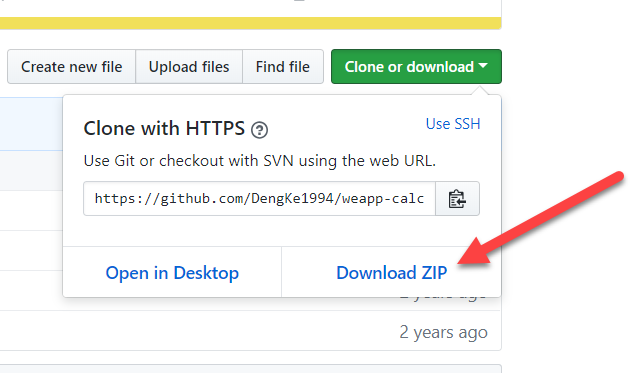
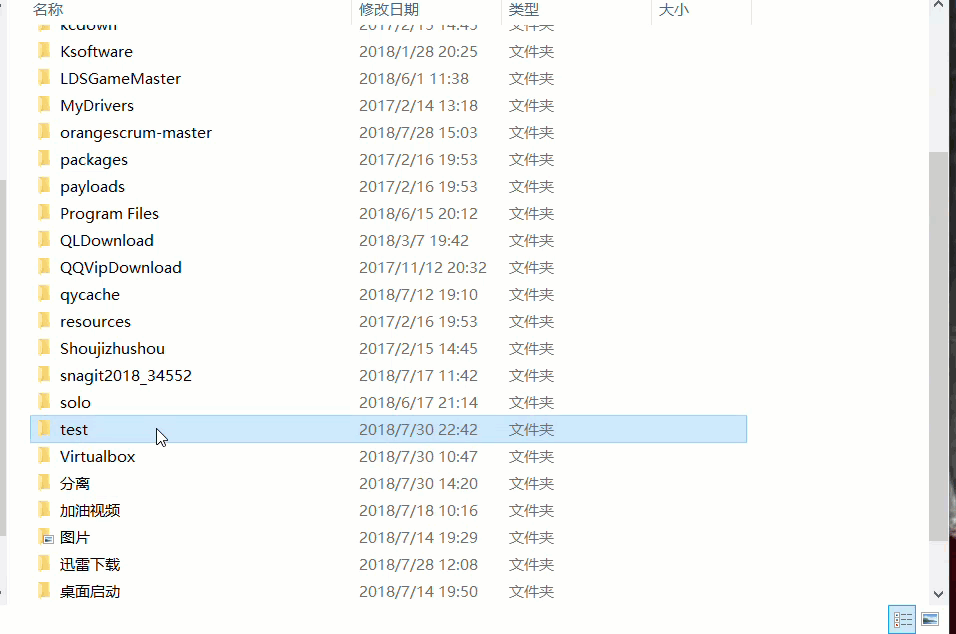
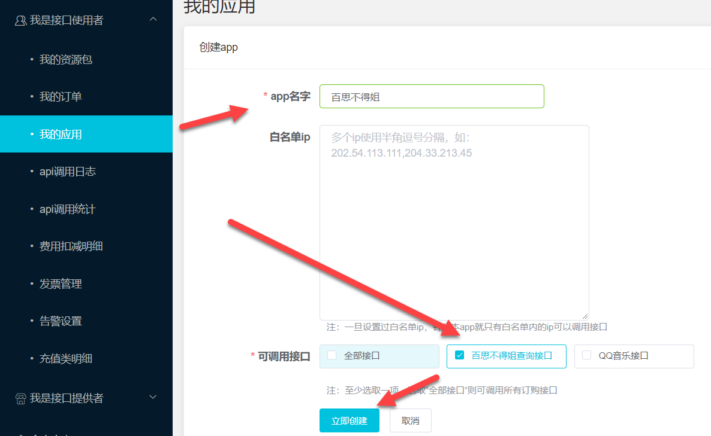

# 微信小程序实例

- IOS计算器
- 百思不得姐

## 准备工作

- 申请账号  [https://developers.weixin.qq.com/miniprogram/dev/quickstart/basic/getting-started.html](https://developers.weixin.qq.com/miniprogram/dev/quickstart/basic/getting-started.html)
- [登录](https://mp.weixin.qq.com )获得Appid
- 安装微信web开发者工具：[https://developers.weixin.qq.com/miniprogram/dev/devtools/download.html?t=2018724](https://developers.weixin.qq.com/miniprogram/dev/devtools/download.html?t=2018724)

## 新建项目

1. 新建一个空文件夹，并命名
2. 填写你的Appid或者点击使用测试版
3. 点击确认即可创建

## IOS计算器

这是一个不用接口的纯微信小程序实现的计算器。

**下载地址** ：[https://github.com/DengKe1994/weapp-calculator](https://github.com/DengKe1994/weapp-calculator)

> 前提，有GitHub账号，如果没有可以前往注册一个，好用的东西

**下载方式：**

1. 直接点击`Download Zip`

	
2. 如果安装有git的话，可以到指定的文件夹，右键鼠标，`git bash here`，输入:
    
	$ git clone 仓库地址 
	
	

**导入项目：**

选择目录：下载好的项目存放的目录，其他步骤同新建项目的第二、三步一样

## 百思不得姐

这是一个**调用了百思不得姐易源接口**获取相关段子、视频、趣图并展示的小程序。

接口详情地址：[https://www.showapi.com/api/view/255](https://www.showapi.com/api/view/255)

**下载地址** ：[https://github.com/Symous/WechatApp-BaisiSister](https://github.com/Symous/WechatApp-BaisiSister)

**下载方式** : 同ios计算器的步骤

**导入项目** : 同ios计算器的步骤

**需要注意** ：由于该项目是两年前的项目，该作者使用的易源接口已经失效了。如果直接导入的话会出现有可能以下画面：

**1. 不在 `request` 合法域名内：** 

这时候你可以通过点击**右上角的详情** ---> **最低端的不校验合法域名的选项**,

或者是到登陆[小程序管理平台](https://mp.weixin.qq.com),在菜单 “设置”-“开发设置” 页面中的服务器域名上**添加**不在`request`合法域名内的域名.

> 如果使用的是本地测试的话，未填写Appid的，是不会有这种情况出现的。

**2. TypeError: Cannot read property 'contentlist' of undefined** 

这个问题描述的是`contentlist`未能读取，被认为未定义。我们在每个页面的js文件中可以看到都有相同的一句：

`requestUrl = "https://route.showapi.com/255-1"`，

很明显这个地址就是该小程序调用的接口的地址。我们猜测该接口也许已经不好用了，才导致了刚刚的问题。我们可以使用**postman**测试一下。

在`app.js`中我们可以看到`globalData`中的`appid`和`apikey`的值分别是多少。它们分别对应的就是百思不得姐接口调用的必须参数
`showapi_appid`和`showapi_sign`我们将它们复制后，使用**[postman](https://www.getpostman.com/)**测试可以看到如下画面：

结果为*未找到可用资源包，请检查是否未订购套餐，或者当前调用量已为0*。由此可知作者当时调用的接口已经过期了。

**解决办法** : 在易源接口中重新购买下该接口的使用权（¥0/年）。

购买后，在点击个人中心或者其他方式进入 “控制台" 在我的应用中选择“添加应用”，如下图操作，创建后就会获得一个Appid和一个apikey密匙

在`app.js`中我们将获得的新`appid`和`apikey`替换掉原来的即可。

如果你嫌购买该接口麻烦的话，也可以使用我的id和key

    appid:71229
    apikey: ac5bb37591c14d24ab99cee0f8b2bc61

## 更多资料请参考

- [官方文档](https://developers.weixin.qq.com/miniprogram/design/index.html)
- [GitHub](https://github.com/justjavac/awesome-wechat-weapp)

