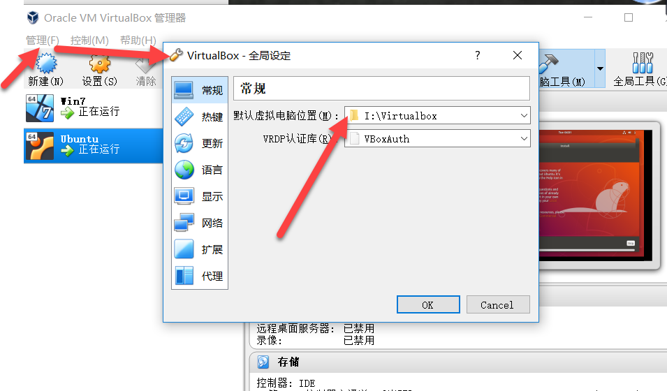
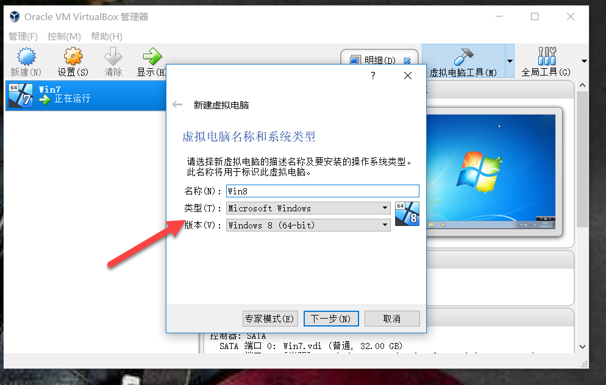
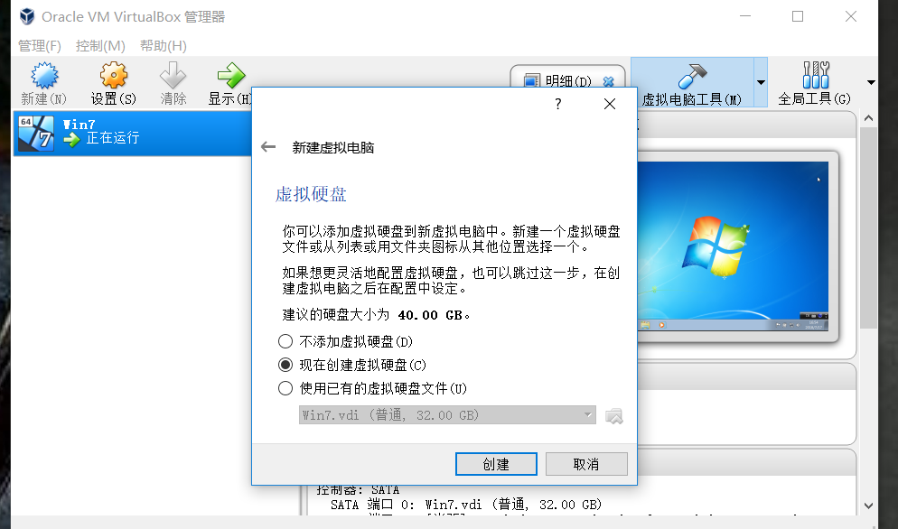
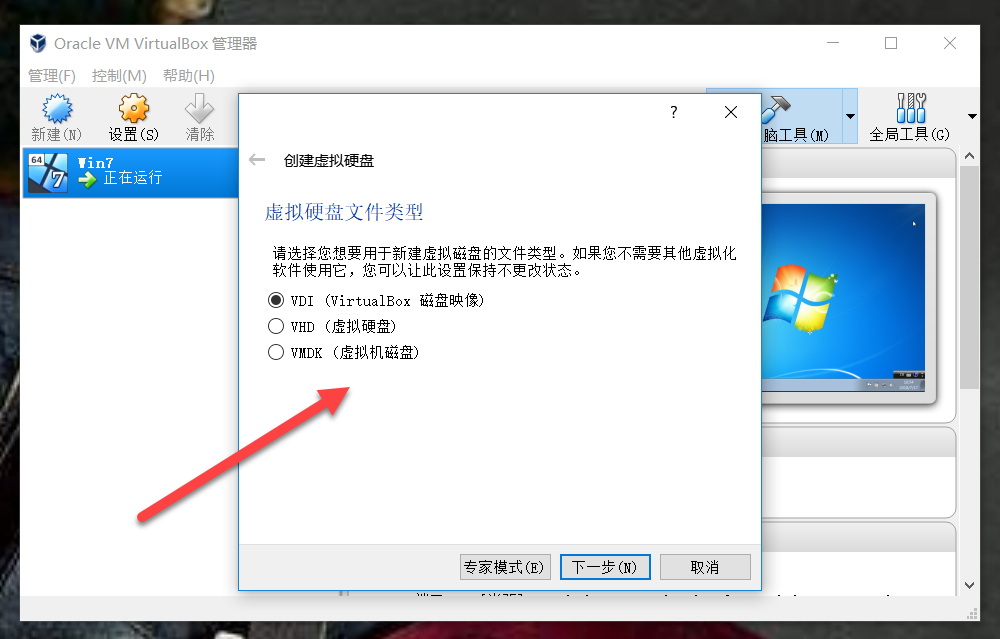
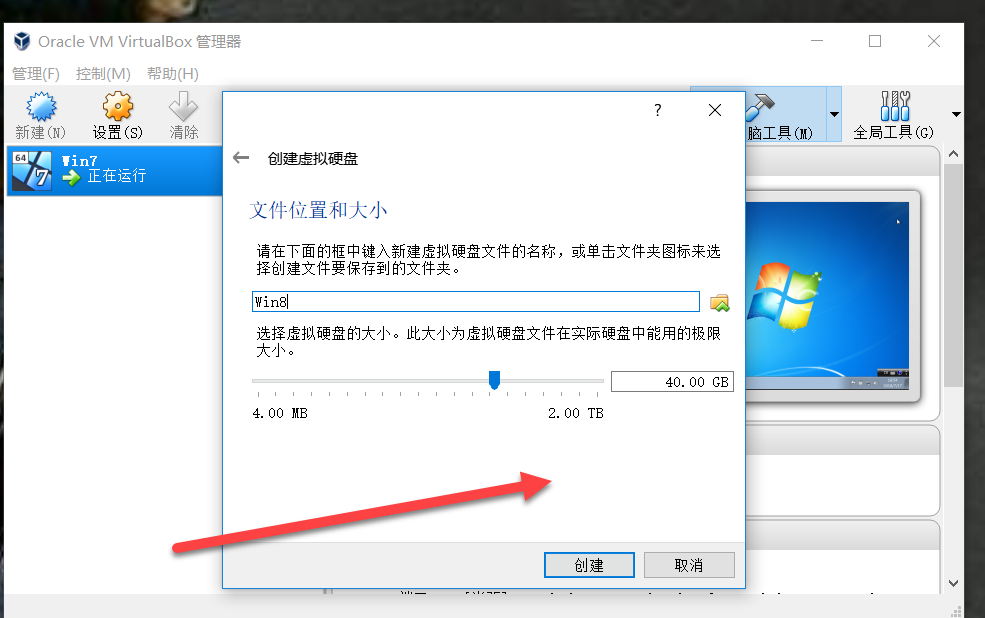
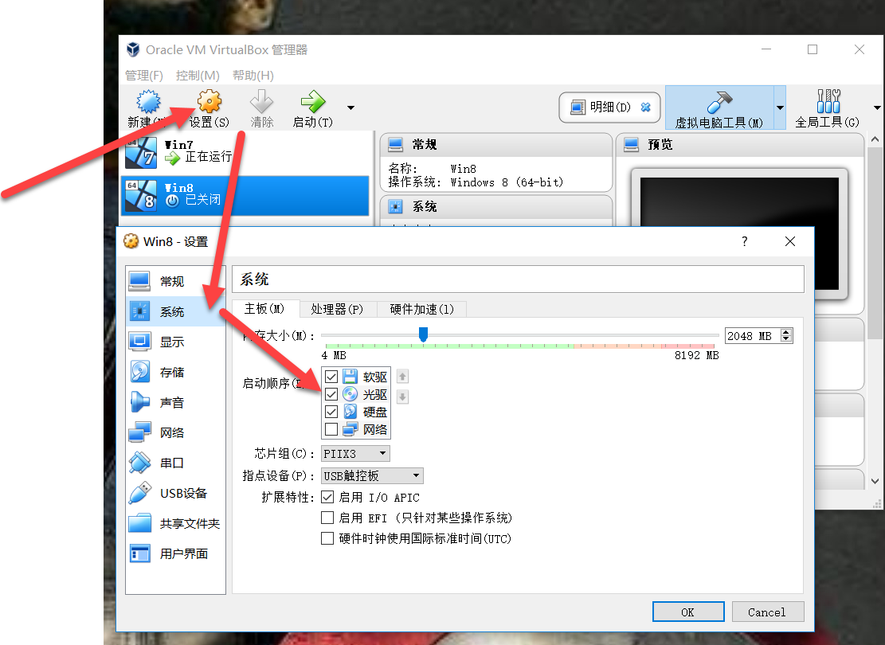
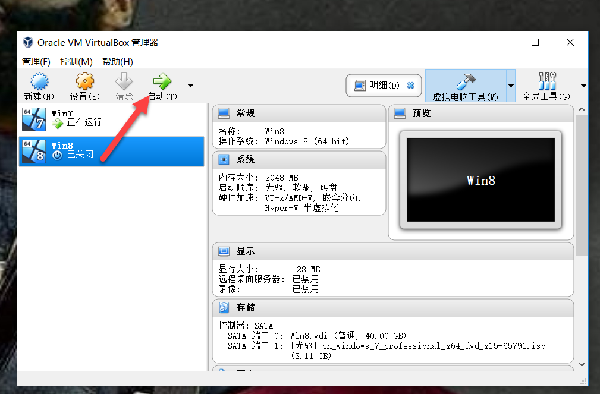
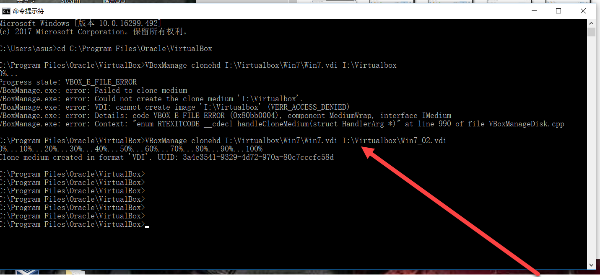
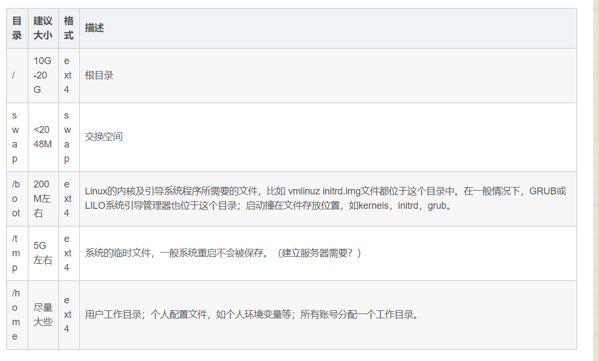

# MarkdownPad

- 下载安装后
- 解决 An error occurred with the Html rendering component
- 重启MarkdownPad即可使用

**解决error需要下载一个工具包**
>  awesomium_v1.6.6_sdk_win

**下载地址**
> [http://markdownpad.com/download/awesomium_v1.6.6_sdk_win.exe](http://markdownpad.com/download/awesomium_v1.6.6_sdk_win.exe)

# VitualBox
VirtualBox 是一款开源虚拟机软件。

## 下载安装
地址：[https://www.virtualbox.org/](https://www.virtualbox.org/)

## 创建虚拟机

接下来一创建Windows7为例

**准备材料：**

- windows7镜像文件

> 地址：[https://msdn.itellyou.cn/](https://msdn.itellyou.cn/)

- 安装好的VitualBox

**步骤：**

1. 修改全局设定。点击管理-->全局设定-->默认虚拟电脑位置

2. 新建--->填写名称、类型

3. 分配内存大小

4. 选择虚拟硬盘的创建方式

5. 选择虚拟硬盘文件类型

6. 存续分配选择

7. 确定文件位置及大小

8. 进入新建虚拟机的设置界面，在系统启动顺序中将光驱调到最前的位置

9. 在存储中添加准备好的镜像文件

10. 设置好后点击启动进入虚拟机,虚拟机上的安装同重装系统一样，按提示操作即可

## 快照
> Snapshots：系统快照，保存虚拟系统在某一时刻的全部运行状态，以后可以将虚拟系统恢复到创建此快照时的状态。在VirtualBox中文版中，snapshots被翻译成“备份”。

**分支快照（branched snapshots）功能**，可以将虚拟系统直接恢复到任意时间的备份，并且保留最近的备份，当修改了过去备份的状态后，可以在原有的备份时间线上创建一个分支，并且可以随时在不同分支上继续运行系统。

## 克隆
语法：
`VBoxManage clonehd 需要克隆的虚拟机vdi路径 克隆成功后的新的虚拟机vdi存放路径 `
> 需要进入到VitualBox的根目录下进行命令行操作

## 导入与导出
- 需要和别人共享你的Virutalbox虚拟机，这样可以省去别人安装虚拟机和配置虚拟机的过程，节省大量时间。
- 当你发现你虚拟机所在的分区没有足够的空间了，你需要把虚拟机转移到另外一个分区上面。
**导出**
1. 点击管理，选择导出虚拟机

2. 按提示操作并勾选勾选“写入Manifest文件”,在许可栏里可以写入备注信息，最后点击导出

3. 点击导出即可

## 导入
1. 点击管理，选择导入虚拟机，选择之前导出的ovi文件即可完成导入

## Ubuntu分区

